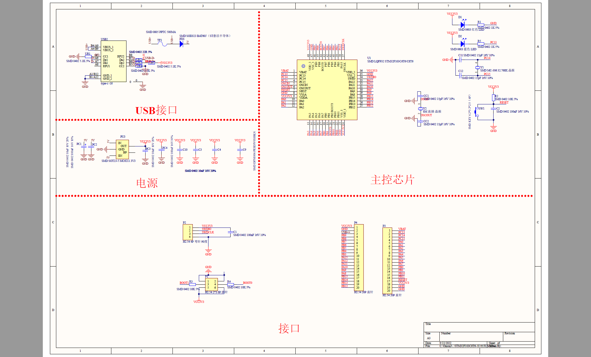

# 江科电协B站STM32入门教程

简介：本项目是[江科电协](https://space.bilibili.com/383400717)的STM32教程的代码仓库。

版本：V1.0

开发板信息：STM32F103C8T6

开发环境：Keil5 MDK+ vs code

下载器：PWLINK2 PowerWriter

原理图：

视频教程：https://www.bilibili.com/video/BV1th411z7sn

代码作者：https://github.com/dongchao980612/Stm32Project

说明：本仓库代码源于官方的分享，学习交流使用。

# 目录

- [chapter1 概述](./chapter/chap1.md)
- [chapter2 软件安装](./chapter/chap2.md)