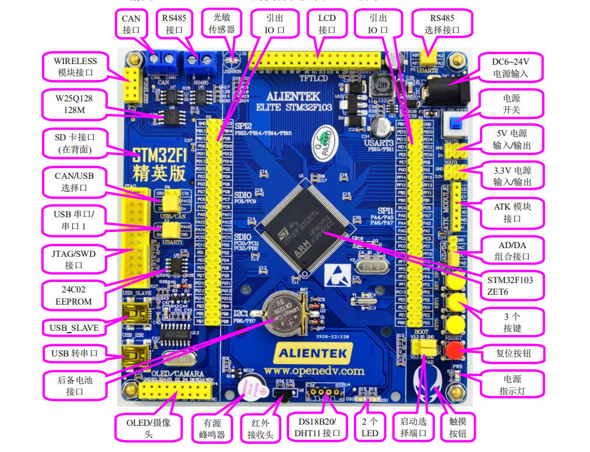

# 江科电协B站STM32入门教程

简介：本项目是[江科电协](https://space.bilibili.com/383400717)的STM32教程的代码仓库。

- 实验器材：正点原子精英STM32F103开发板

- 芯片版本：STM32F103ZET6

- Keil版本：5.24

- 外设库版本：STM32F10x_StdPeriph_Lib_V3.5.0

- 启动文件：startup_stm32f10x_hd.s

资源图：

视频教程：https://www.bilibili.com/video/BV1th411z7sn

代码作者：https://github.com/dongchao980612/STM32ProjectByJDK

说明：本仓库代码源于官方的分享，学习交流使用。

# 目录

|         章节名称         |    外设     | 引脚 | Hardware | 现象 |
| :----------------------: | :---------: | :--: | :------: | :--: |
|       3-1 LED闪烁        |    LED0     |      |          |      |
|      3-2 LED流水灯       |    LED0     |      |          |      |
|                          |    LED1     |      |          |      |
|        3-3 蜂鸣器        |    BEEP     |      |          |      |
|     3-4 按键控制LED      |    LED0     |      |          |      |
|                          |    KEY0     |      |          |      |
|                          |    KEY1     |      |          |      |
|                          |   KEY_UP    |      |          |      |
| 3-5 光敏传感器控制蜂鸣器 |    LED0     |      |          |      |
|                          |    BEEP     |      |          |      |
|                          | LightSensor |      |          |      |
|                          |             |      |          |      |

