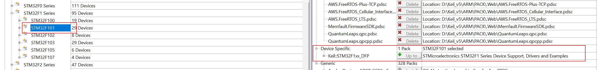
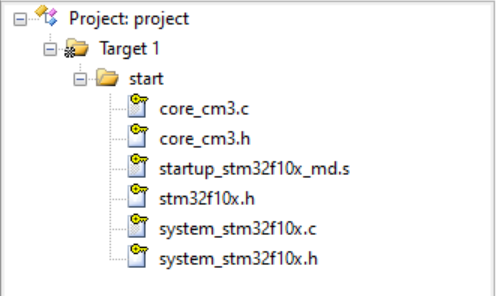
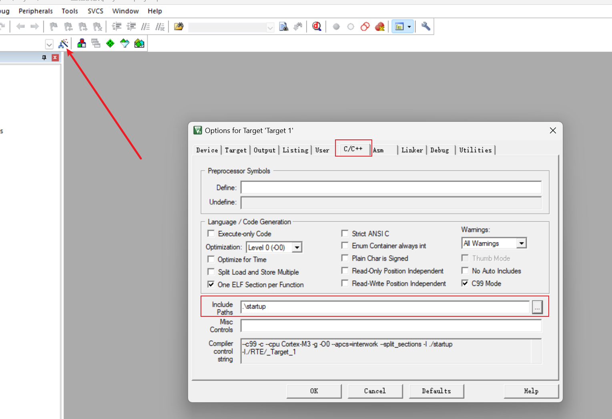
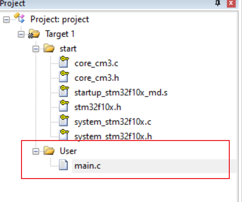
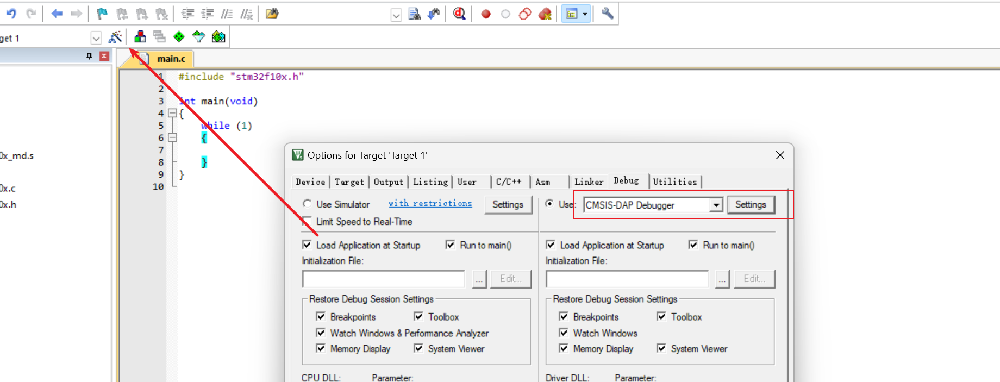
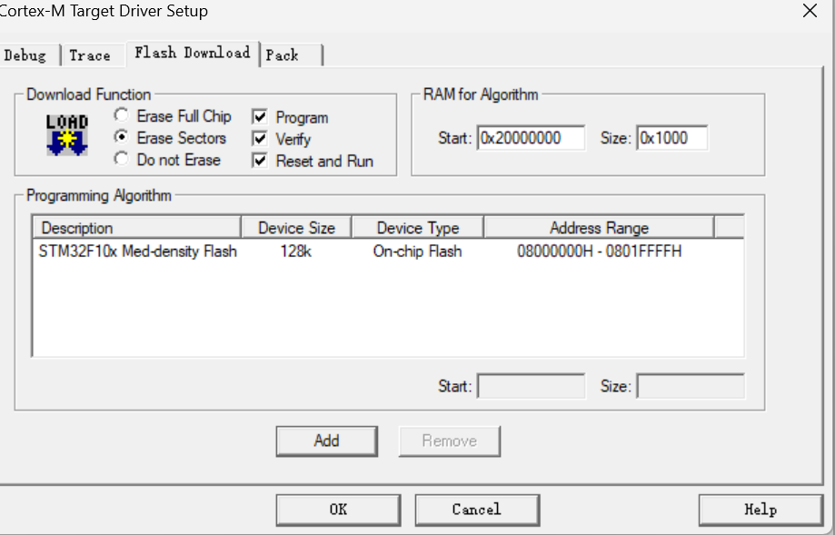
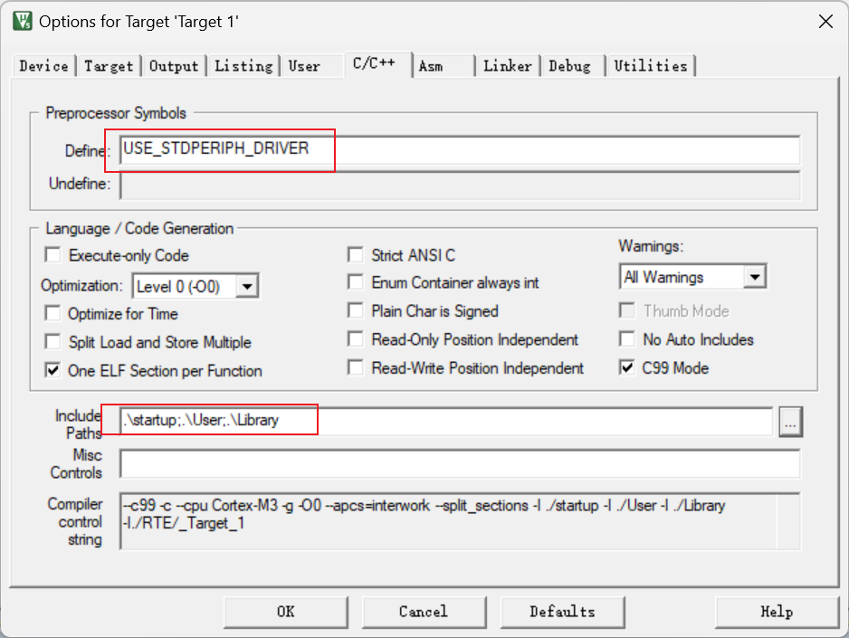

# 第二章 软件安装与配置

## 2.1 软件安装

### 安装Keil5 MKD

MDK:[MDK软件包镜像下载](https://blog.csdn.net/Simon223/article/details/105090189)

### 安装支持包

在线支持包：[Keil MDK STM32全系列PACK包](https://blog.csdn.net/Simon223/article/details/105090189/)

离线安装：


### 软件注册

### ST-LINk安装
位置：`D:\Keil_v5\ARM\STLink\USBDriver`
安装：双击`dpinst_amd64.exe`即可

### 安装USB转串口驱动

[沁恒官网](https://www.wch.cn/downloads/file/65.html?time=2024-11-30%2017:16:41&code=XrZXK1c2iWjd9VNAzAdx7msiuJCZWSsUROLN7EDV)

## 2.2 新建工程

### 新建工程

略

### 添加固件库

- 新建文件夹`startup`

- 将`STM32F10x_StdPeriph_Lib_V3.5.0\Libraries\CMSIS\CM3\DeviceSupport\ST\STM32F10x\startup\arm` 目录下的`startup_stm32f10x_md.s`文件复制到`startup`文件里面

- 将`STM32F10x_StdPeriph_Lib_V3.5.0\Libraries\CMSIS\CM3\DeviceSupport\ST\STM32F10x`目录下的`stm32f10x.h`、`system_stm32f10x.c`、`system_stm32f10x.h`文件复制到`startup`文件里面

- 将`STM32F10x_StdPeriph_Lib_V3.5.0\Libraries\CMSIS\CM3\CoreSupport`目录下的`core_cm3.h`、`core_cm3.c·`文件复制到`startup`文件里面
- 添加到工程
- 


### 添加头文件路径


添加main函数



### 修改调试器



勾选Reset and Run按钮



### 点亮LED【寄存器】

```c
// 寄存器版本
#include "stm32f10x.h"

int main(void)
{
    RCC->APB2ENR |= 0x00000010; // 使能GPIOA时钟
    GPIOC->CRH = 0x00300000;    // 设置GPIOC的四个引脚为推挽输出模式
    GPIOC->ODR = 0x00002000;    // LED为低电平点亮模式
    // 0x00000000 点亮LED
    // 0x00002000 关闭LED
    while (1)
    {
    }
}
```

新建文件夹`Library`，并将`STM32F10x_StdPeriph_Lib_V3.5.0\Libraries\STM32F10x_StdPeriph_Driver\src`和`inc`下面的文件复制到`Library`
把`STM32F10x_StdPeriph_Lib_V3.5.0\Project\STM32F10x_StdPeriph_Template`下面的`stm32f10x_it.c`、`stm32f10x_it.h`、`stm32f10x_conf.h`复制到`User`目录下

将宏定义添加到工程，并且添加头文件路径



### 点亮LED【库函数】

```c
#include "stm32f10x.h"
#include "stm32f10x_gpio.h"

int main(void)
{
    /*开启时钟*/
    RCC_APB2PeriphClockCmd(RCC_APB2Periph_GPIOC, ENABLE); // 开启GPIOC的时钟
                                                          // 使用各个外设前必须开启时钟，否则对外设的操作无效

    /*GPIO初始化*/
    GPIO_InitTypeDef GPIO_InitStructure; // 定义结构体变量

    GPIO_InitStructure.GPIO_Mode = GPIO_Mode_Out_PP;  // GPIO模式，赋值为推挽输出模式
    GPIO_InitStructure.GPIO_Pin = GPIO_Pin_13;        // GPIO引脚，赋值为第13号引脚
    GPIO_InitStructure.GPIO_Speed = GPIO_Speed_50MHz; // GPIO速度，赋值为50MHz

    GPIO_Init(GPIOC, &GPIO_InitStructure); // 将赋值后的构体变量传递给GPIO_Init函数
                                           // 函数内部会自动根据结构体的参数配置相应寄

    /*设置GPIO引脚的高低电平*/
    /*若不设置GPIO引脚的电平，则在GPIO初始化为推挽输出后，指定引脚默认输出低电平*/
    // GPIO_SetBits(GPIOC, GPIO_Pin_13); // 将PC13引脚设置为高电平，熄灭
    // GPIO_ResetBits(GPIOC, GPIO_Pin_13); // 将PC13引脚设置为低电平，点亮
    while (1)
    {
    }
}

```

